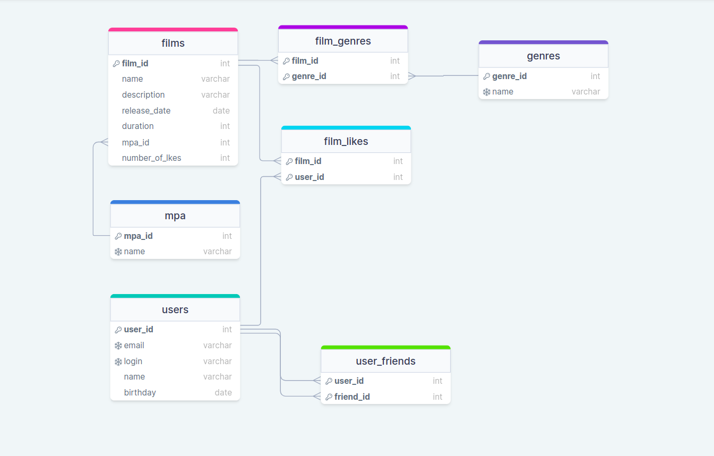

# java-filmorate

Функциональность приложения эквивалентна API, посредством которого происходит взаимодействие.
## Реализованные эндпоинты:

<details> 
 <summary><h3>Пользователи</h3></summary>

* **GET** /users - получение списка всех пользователей
* **GET** /users/{userId} - получение информации о пользователе по его id
* **POST** /users - создание пользователя
* **PUT** /users - редактирование пользователя
* **PUT** /users/{id}/friends/{friendId} — добавление в друзья
* **DELETE** /users/{id}/friends/{friendId} — удаление из друзей
* **GET** /users/{id}/friends — возвращает список пользователей, являющихся его друзьями
* **GET** /users/{id}/friends/common/{otherId} — список друзей, общих с другим пользователем
</details>

<details>
  <summary><h3>Фильмы</h3></summary>

* **GET** /films - получение списка всех фильмов
* **GET** /films/{filmId} - получение информации о фильме по его id
* **POST** /films - создание фильма
* **PUT** /films - редактирование фильма
* **PUT** /films/{id}/like/{userId} — пользователь ставит лайк фильму
* **DELETE** /films/{id}/like/{userId} — пользователь удаляет лайк
* **GET** /films/popular?count={count} — возвращает список из первых count фильмов по количеству лайков. Если значение параметра count не задано, возвращает первые 10

</details>
<details>
  <summary><h3>Жанры</h3></summary>

* **GET** /genres - получение списка всех жанров
* **GET** /genres/{id} - получение информации о жанре по его id

</details>
<details>
  <summary><h3>Рейтинги</h3></summary>

* **GET** /mpa - получение списка всех рейтингов
* **GET** /mpa/{id} - получение информации о рейтинге по его id

</details>

## Схема БД и примеры запросов



<details>
  <summary><h3>Для пользователей:</h3></summary>

* создание пользователя
```SQL
INSERT INTO users (email, login, name, birthday)
VALUES ( ?, ?, ?, ? );
```
* редактирование пользователя
```SQL
UPDATE users
SET email = ?,
    login = ?,
    name = ?,
    birthday = ?
WHERE user_id = ?
```
* получение списка всех пользователей
```SQL
SELECT *
FROM users
```
* получение информации о пользователе по его `id`
```SQL
SELECT *
FROM users
WHERE user_id = ?
```
* добавление в друзья
```SQL
INSERT INTO user_friends(user_id, friend_id) VALUES (?, ?)

```
* удаление из друзей
```SQL
DELETE
FROM user_friends
WHERE user_id = ? AND friend_id = ?
```
* возвращает список пользователей, являющихся его друзьями
```SQL
select * from USERS 
where USER_ID in
(select FRIEND_ID from USER_FRIENDS 
where USER_ID = ?)
```
* список друзей, общих с другим пользователем
```SQL
SELECT users.*
FROM users
INNER JOIN user_friends ON users.user_id = user_friends.friend_id
WHERE user_friends.user_id = ?

INTERSECT

SELECT users.*
FROM users
INNER JOIN user_friends ON users.user_id = user_friends.friend_id
WHERE user_friends.user_id = ?
```

</details>
<details>
  <summary><h3>Для фильмов:</h3></summary>

* создание фильма
```SQL
INSERT INTO films (name, description, release_date, duration_in_minutes, mpa_id)
VALUES (?, ?, ?, ?, ?)
```
* редактирование фильма
```SQL
UPDATE films
SET name = ?,
    description = ?,
    release_date = ?,
    duration_in_minutes = ?,
    mpa_id = ?
WHERE film_id = ?
```
* получение списка всех фильмов
```SQL
SELECT * FROM films
```
* получение информации о фильме по его `id`
```SQL
SELECT * FROM films f  WHERE f.film_id = ?
```
* пользователь ставит лайк фильму
```SQL
INSERT INTO film_likes(film_id, user_id) VALUES (?, ?)
```
* пользователь удаляет лайк
```SQL
DELETE
FROM film_likes
WHERE film_id = ? AND user_id = ?
```
* возвращает список из первых `count` фильмов по количеству лайков
```SQL
SELECT * FROM films ORDER BY number_of_likes DESC LIMIT ?
```

</details>
<details>
  <summary><h3>Для жанров:</h3></summary>

* получение списка всех жанров
```SQL
SELECT *
FROM genres
ORDER BY genre_id
```
* получение информации о жанре по его `id`
```SQL
SELECT *
FROM genres
WHERE genre_id = ?
```

</details>
<details>
  <summary><h3>Для рейтингов:</h3></summary>

* получение списка всех рейтингов
```SQL
SELECT *
FROM mpa
ORDER BY mpa_id
```
* получение информации о рейтинге по его `id`
```SQL
SELECT *
FROM mpa
WHERE mpa_id = ?
```

</details>